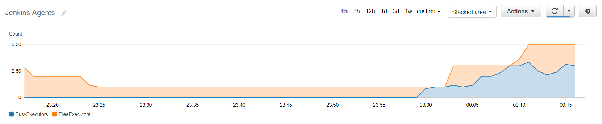

# docker-jenkins-autoscaler

A utility container that helps autoscaling your Jenkins nodes in AWS.

It does two things:

  1. Provides a custom metric that the node ASG can use to scale off of: idle executors
  2. Protects busy agents from being terminated during scale-in

## How To Use

Run this in your userdata on your Jenkins master, where `<unique identifier>` is something that uniquely identifies your Jenkins master (in case you have multiple Jenkins clusters):

```bash
export JENKINS_METRICS_PASSWORD=<password>
docker run -d --restart=always --net=host -e JENKINS_METRICS_USERNAME=<username> -e JENKINS_METRICS_PASSWORD -e JENKINS_METRICS_MASTER=<unique identifier> aarongorka/jenkins-autoscaler:1.0.0
```

Then, configure the ASG of your agents to scale off of the custom metric:

```hcl
resource "aws_autoscaling_policy" "jenkins-agents-scale-in-policy" {
  name                   = "jenkins-agents-scale-in-policy"
  autoscaling_group_name = "${aws_autoscaling_group.jenkins-agents.name}"
  scaling_adjustment     = "-1"
  adjustment_type        = "ChangeInCapacity"
}
resource "aws_cloudwatch_metric_alarm" "jenkins-agents-scale-in-alarm" {
  alarm_name          = "jenkins-agents-scale-in"
  comparison_operator = "GreaterThanOrEqualToThreshold"
  metric_name         = "FreeExecutors"
  namespace           = "Jenkins"
  dimensions = {
    JenkinsMaster = "<unique identifier>"
  }
  period              = "30"
  evaluation_periods  = "6"
  statistic           = "Average"
  threshold           = "5"

  alarm_description = "Scale in Jenkins agents"
  alarm_actions     = ["${aws_autoscaling_policy.jenkins-agents-scale-in-policy.arn}"]
}

resource "aws_autoscaling_policy" "jenkins-agents-scale-out-policy" {
  name                   = "jenkins-agents-scale-out-policy"
  autoscaling_group_name = "${aws_autoscaling_group.jenkins-agents.name}"
  scaling_adjustment     = "2"
  adjustment_type        = "ChangeInCapacity"
}
resource "aws_cloudwatch_metric_alarm" "jenkins-agents-scale-out-alarm" {
  alarm_name          = "jenkins-agents-scale-out"
  comparison_operator = "LessThanOrEqualToThreshold"
  metric_name         = "FreeExecutors"
  namespace           = "Jenkins"
  dimensions = {
    JenkinsMaster = "<unique identifier>"
  }
  period              = "30"
  evaluation_periods  = "1"
  statistic           = "Minimum"
  threshold           = "0"

  alarm_description = "Scale in Jenkins agents"
  alarm_actions     = ["${aws_autoscaling_policy.jenkins-agents-scale-out-policy.arn}"]
}
```

## Observability

  * You can build a graph that displays idle/busy executors using CloudWatch Metrics:



  * Logs from the container contain JSON formatted output. You can view with `docker logs` on the Jenkins master instance.
  * You can view the scale-in protection status on the ASG section of the AWS console by selecting the agent ASG and going to the "Instances" tab.
